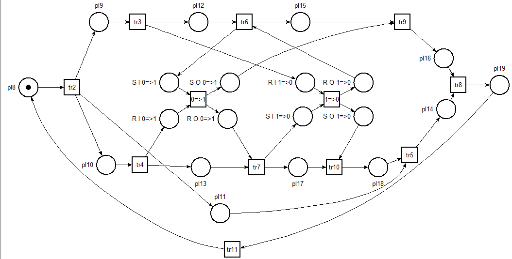
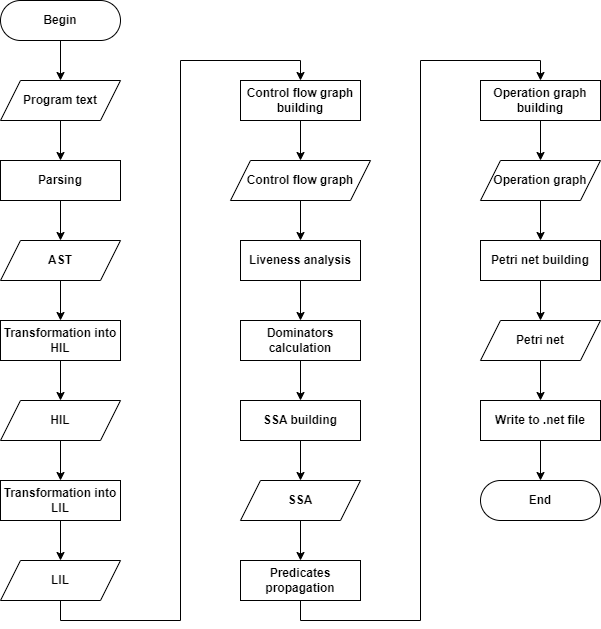

# deadlock-finder

A tool for finding deadlocks in programs using MPI library for Java.

This is a static code analyzer. It takes a Java program that uses MPI library (MPJ Express) and outputs a program model in the form of Petri net. Later, the Petri net can be analyzed by Tina tool to check if the program has deadlocks.

The resulting Petri net can look like this:



For now, Tina should be run manually. In the future it should be possible to run Tina automatically.

The project is described in details in my [master's thesis](assets/master-thesis.pdf)

## Building

To build the project you need Scala 3 compiler and SBT (e.g. 1.6.2). 

Also you need to download MPJ Express at [http://www.mpjexpress.org/download.php](http://www.mpjexpress.org/download.php) and set MPJ_HOME environment variable to the installation folder.

Start sbt shell

```
> sbt
```

and run compile

```
sbt:deadlock-finder> compile
```

## Running

Start sbt shell

```
> sbt
```

Then, run an example [program](examples/parallel/MpiSendRecvSimple.java)

```
sbt:deadlock-finder> run examples/parallel/MpiSendRecvSimple.java
```

File [target/net.net](target/net.net) will be created. 
This file can be viewed in **nd** utility of Tina package. Tina can be downloaded at [https://projects.laas.fr/tina/download.php](https://projects.laas.fr/tina/download.php). Open the file, then draw the Petri net (Edit\draw), choose graphplace. After that, you can run step-by-step simulation for the Petri net (Tools\stepper simulator).

Automatic verification of the Petri can be done by **sift** utility of Tina package. For example:

```
> C:\programs\tina-3.7.0\bin\sift.exe .\target\net.net -dead

16 marking(s), 20 transitions(s)
0.000s
```

This result says that there are no deadlocks in the program.

## Overview of the implementation

An algorithm was developed to automatically build the Petri net. To analyze the program, we used both traditional approaches from the field of compiler development (dominators, SSA form, data flow analysis, and others) and new approaches specialized for the current task, such as determining the ranks of processes and the graph of operations.

- The text of the input program is parsed using the Eclipse JDT library. As a result, an abstract syntax tree (AST) is created.
- AST is transformed into a form of HIL - a high-level intermediate language.
- The HIL form is transformed into the LIL form, a low-level intermediate language.
- Based on the LIL form, a control flow graph is built.
- The LIL shape and the control flow graph are used to partially execute the program. This is mostly done for the purpose of deploying loops.
- The analysis of the variables' liveness is performed.
- Information about dominators is calculated.
- Based on the analysis of liveliness and information about dominators, the SSA form is built.
- Predicate propagation is performed. It determines which code blocks are executed by which process.
- The operation graph is being built.
- The operation graph is transformed into a Petri net.
- the Petri net is written to a file with the .net extension of the Tina format.



For details, see the [thesis](assets/master-thesis.pdf), Section 2.